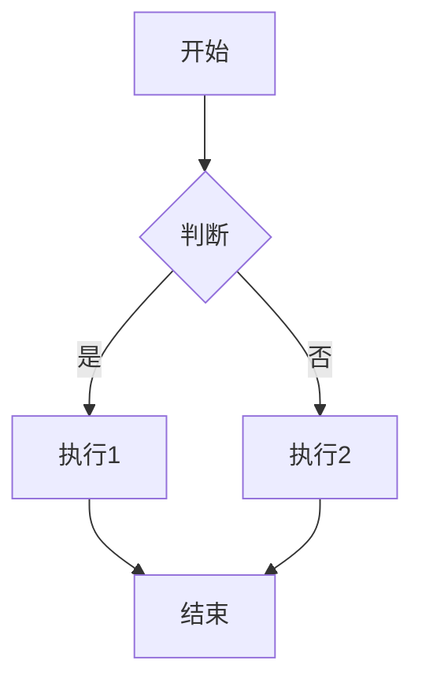
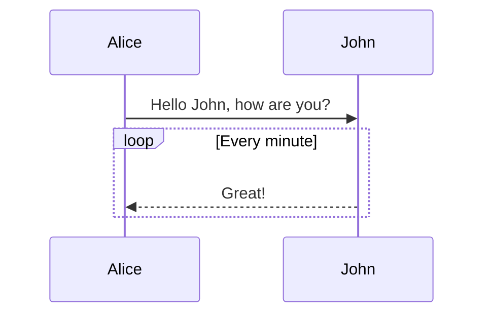
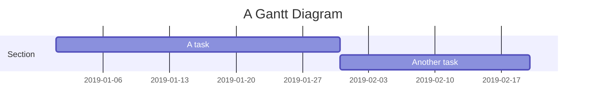
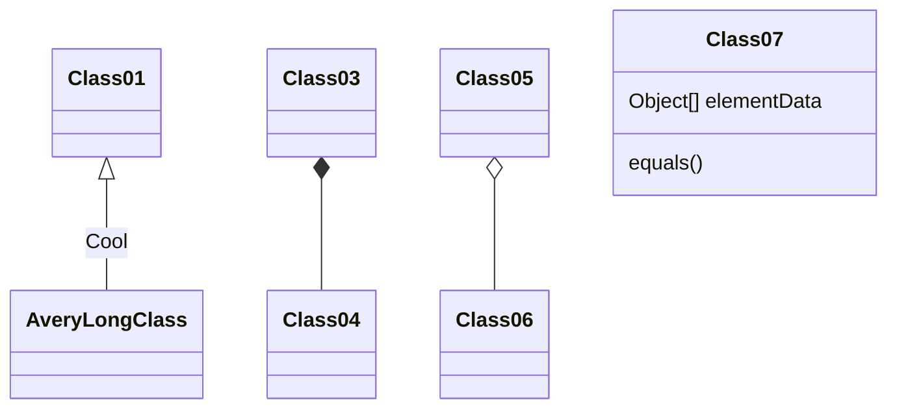
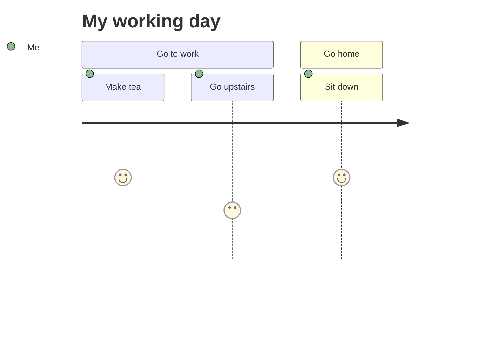
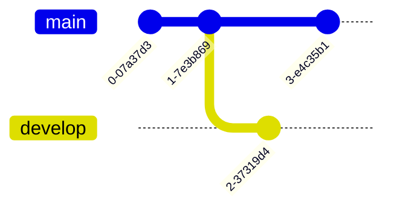
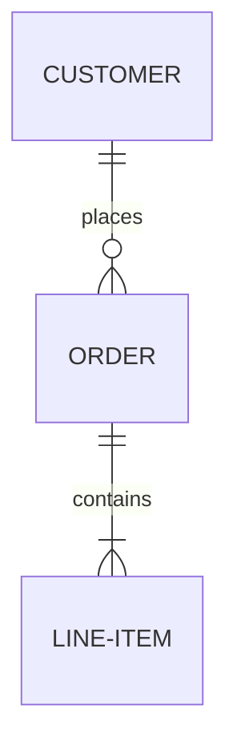
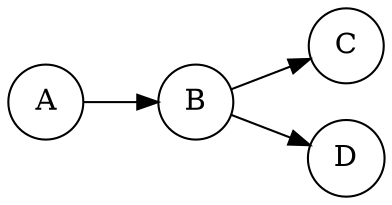
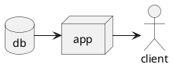

# 思源笔记排版语法指南（MCP 实践版）

本指南基于 MCP 直接调用验证，所有示例均可通过 `block(action="append", dataType="markdown", data="...")` 写入思源并正确渲染。

## 快速写入任意内容

```python
block(action="append", parentID="文档ID", dataType="markdown",
      data="""你的 Markdown 内容""")
```

## 行级元素

```markdown
**加粗**、*倾斜*、<u>下划线</u>、~~删除线~~、==标记==
<sup>上标</sup>、<sub>下标</sub>、<kbd>Ctrl</kbd>+<kbd>S</kbd>
`行级代码`、#标签#、$a^2 + b^2 = c^2$
备注<sup>（行级备注）</sup>
```

### 颜色样式

```markdown
**颜色1**{: style="color: var(--b3-font-color1); background-color: var(--b3-font-background1);"}
**颜色2**{: style="color: var(--b3-font-color2); background-color: var(--b3-font-background2);"}
```

可用变量：`--b3-font-color1~13`、`--b3-font-background1~13`

### 特效文字

```markdown
**镂空**{: style="-webkit-text-stroke: 0.2px var(--b3-theme-on-background); -webkit-text-fill-color: transparent;"}
**阴影**{: style="text-shadow: 1px 1px var(--b3-border-color), 2px 2px var(--b3-border-color);"}
```

### 表情符号

输入 `:` 加字母触发搜索，例如 `:smile` → 😄

---

## 超级块

### 横向排列（row）

```markdown
{{{row
段落一

段落二
}}}
```

### 纵向排列（col）

```markdown
{{{col
段落一

段落二
}}}
```

### 纵横混合（带对齐样式）

```markdown
{{{col
{{{row
段落一

段落二居中{: style="text-align: center;"}
}}}

{{{row
段落三

段落四居右{: style="text-align: right;"}
}}}
}}}
```

### 卡片颜色变量

- `--b3-card-error-color/error-background` - 红色
- `--b3-card-warning-color/warning-background` - 黄色
- `--b3-card-info-color/info-background` - 蓝色
- `--b3-card-success-color/success-background` - 绿色

---

## 标题

```markdown
# 一级标题
## 二级标题
### 三级标题
#### 四级标题
##### 五级标题
###### 六级标题
```

---

## 列表

### 无序列表（支持多级嵌套）

```markdown
- Java
  - Spring
    - IoC
    - AOP
- Go
  - gofmt
  - Wide
```

### 有序列表

```markdown
1. Node.js
   1. Express
   2. Koa
2. Go
   1. gofmt
   2. Wide
```

### 任务列表

```markdown
- [X] 已完成任务
- [ ] 未完成任务
- [ ] 待办事项
```

---

## 代码块

### 普通代码块

````markdown
```
普通代码
```
````

### 语法高亮

````markdown
```go
package main

import "fmt"

func main() {
	fmt.Println("Hello, 世界")
}
```

```java
public class HelloWorld {
    public static void main(String[] args) {
        System.out.println("Hello World!");
    }
}
```

```python
print("Hello World")
```
````

支持语言：`python`, `javascript`, `js`, `typescript`, `ts`, `go`, `java`, `c`, `cpp`, `rust`, `bash`, `sh`, `json`, `yaml`, `yml`, `xml`, `html`, `css`, `scss`, `sql`, `markdown`, `md` 等

---

## 表格

```markdown
| 表头 1 | 表头 2 |
| ------ | ------ |
| cell 1 | cell 2 |
| cell 3 | cell 4 |
| cell 5 | cell 6 |
```

---

## 引述块与提示块（Callout）

### 普通引述块

```markdown
> 引述内容
> 可以多行
```

### 提示块

```markdown
> [!NOTE]
> 突出显示即使快速浏览也应注意的信息。

> [!TIP]
> 可选信息，有助于更顺利地完成任务。

> [!IMPORTANT]
> 成功完成任务所必需的关键信息。

> [!WARNING]
> 由于存在潜在风险，此重要内容需要立即关注。

> [!CAUTION]
> 某项操作可能带来的负面后果。
```

---

## 数学公式

### 行内公式

```markdown
$E = mc^2$

$a^2 + b^2 = \color{red}c^2$
```

### 块级公式

```markdown
$$
\frac{1}{
  \Bigl(\sqrt{\phi \sqrt{5}}-\phi\Bigr) e^{\frac25 \pi}}
  = 1+\frac{e^{-2\pi}} {1+\cdots}
$$
```

---

## HTML 块

```markdown
<div>
<ruby>
你<rt>nǐ</rt>
好<rt>hǎo</rt>
世<rt>shì</rt>
界<rt>jiè</rt>
</ruby><br>
Hello World
</div>
```

---

## 分隔线

```markdown
---
```

---

## 嵌入块

将 SQL 查询结果动态渲染到文档中：

```markdown
{{SELECT * FROM blocks WHERE type = 'p' LIMIT 5}}
```

使用 FTS 查询性能更好：

```markdown
{{SELECT * FROM blocks_fts WHERE blocks_fts MATCH 'content:关键词' LIMIT 10}}
```

---

## 脑图（Mindmap）

使用 Markdown 列表语法渲染：

````markdown
```mindmap
- 中心主题
  - 分支1
    - 子分支1.1
    - 子分支1.2
  - 分支2
    - 子分支2.1
```
````

---

## Mermaid 图表

### 流程图

````markdown

````

### 时序图

````markdown

````

### 甘特图

````markdown

````

### 类图

````markdown

````

### 用户游历图

````markdown

````

### Git 图

````markdown

````

### 实体关系图

````markdown

````

---

## ECharts 图表

````markdown
```echarts
{
  "title": { "text": "最近 30 天" },
  "backgroundColor": "transparent",
  "tooltip": { "trigger": "axis" },
  "legend": { "data": ["帖子", "用户", "回帖"] },
  "xAxis": [{ "type": "category", "data": ["周一", "周二", "周三"] }],
  "yAxis": [{ "type": "value" }],
  "series": [
    { "name": "帖子", "type": "line", "data": [120, 200, 150] },
    { "name": "用户", "type": "line", "data": [80, 150, 100] }
  ]
}
```
````

---

## 五线谱（ABC Notation）

````markdown
```abc
X: 24
T: Clouds Thicken
C: Paul Rosen
M: 6/8
L: 1/8
K: Em
|:"Em"EEE E2G|"C7"_B2A G2F|
```
````

可在首行加入 `%%params JSON` 作为 `renderAbc` 参数。

---

## Graphviz

````markdown

````

---

## Flowchart.js

````markdown
```flowchart
st=>start: Start
op=>operation: Your Operation
cond=>condition: Yes or No?
e=>end

st->op->cond
cond(yes)->e
cond(no)->op
```
````

---

## PlantUML

````markdown

````

---

## MCP 写入方式替代方案

除了 `block(action="append")`，还可以用以下 action 写入排版内容：

### `block(action="prepend")`

在文档或父块的**最前面**插入内容。

```python
block(action="prepend", parentID="文档ID", dataType="markdown",
      data="# 前言\n\n这是放在文档最前面的内容。")
```

### `block(action="insert")`

在指定块的**前面或后面**插入内容。

```python
# 在已有块之后插入
block(action="insert", dataType="markdown",
      data="## 中间插入的标题",
      previousID="前一个块ID")
```

### `block(action="batch_insert")`

一次性插入**多个独立块**，适合写入复杂的多段结构。

```python
block(action="batch_insert", blocks=[
    {"dataType": "markdown", "data": "## 标题1"},
    {"dataType": "markdown", "data": "段落1"},
    {"dataType": "markdown", "data": "```python\nprint(1)\n```"}
])
```

### `block(action="update")`

修改**已有块**的内容，适合修正。

```python
block(action="update", id="已有块ID", dataType="markdown",
      data="修改后的新内容")
```

### `document(action="create")`

创建文档时**直接带全部 markdown 内容**。

```python
document(action="create", notebook="笔记本ID", path="/路径",
         markdown="# 标题\n\n**加粗**、*倾斜*\n\n```go\nfmt.Println()\n```")
```

---

## MCP 调用完整示例

### 示例 1：写入一个包含多种行级元素的段落

```python
block(action="append", parentID="文档ID", dataType="markdown",
      data="这里有**加粗**、*倾斜*、<u>下划线</u>、~~删除线~~、==标记==、`行级代码`、#标签# 和数学公式 $E=mc^2$")
```

### 示例 2：写入提示块

```python
block(action="append", parentID="文档ID", dataType="markdown",
      data="> [!IMPORTANT]\\n> 成功完成任务所必需的关键信息。")
```

### 示例 3：写入 Mermaid 流程图

```python
block(action="append", parentID="文档ID", dataType="markdown",
      data='''```mermaid\ngraph TB\n    A[开始] --> B{判断}\n    B -->|是| C[执行1]\n    B -->|否| D[执行2]\n```''')
```

### 示例 4：写入嵌入查询块

```python
block(action="append", parentID="文档ID", dataType="markdown",
      data="{{SELECT * FROM blocks WHERE type = 'p' LIMIT 5}}")
```

### 示例 5：写入超级块

```python
block(action="append", parentID="文档ID", dataType="markdown",
      data='''{{{col\n{{{row\n左列内容\n\n右列内容{: style="text-align: center;"}\n}}}\n}}}''')
```

---

## MCP 暂不支持直接渲染的元素

以下元素需要本地资源或 HTML 直接插入，通过 `block(action="append", dataType="markdown")` 写入 markdown 时**无法完整呈现**：

| 元素 | 原因 | 替代方案 |
|------|------|---------|
| **图片** | 需要 `assets/` 下的真实文件路径 | 先用 `file(action="upload_asset")` 上传，再引用 |
| **视频** | 需要本地媒体资源文件 | 通过 `file` 上传后使用 `<video>` 标签 |
| **音频** | 需要本地媒体资源文件 | 通过 `file` 上传后使用 `<audio>` 标签 |
| **IFrame** | 需要 HTML 块直接嵌入外部 iframe | 使用 `block(action="append", dataType="dom")` 或手动插入 HTML 块 |

---

## 对齐样式速查

```markdown
{: style="text-align: left;"}     ← 左对齐
{: style="text-align: center;"}   ← 居中
{: style="text-align: right;"}    ← 右对齐
{: style="text-align: justify;"}  ← 两端对齐
```

## 常用快捷键语法

```markdown
<kbd>Ctrl</kbd>+<kbd>S</kbd>
<kbd>Ctrl</kbd>+<kbd>B</kbd>
<kbd>Ctrl</kbd>+<kbd>Z</kbd>
```
