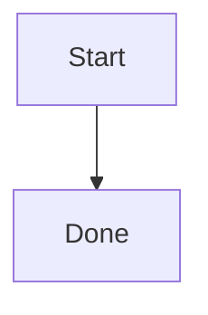

# SiYuan Markup Guide with MCP

Pass rich content as Markdown to block or document write actions. Keep each write bounded and read the result after insertion.

```text
block(action="append", parentID="<doc-id>", dataType="markdown", data="## Heading\n\nParagraph with **bold** text.")
```

## Common markup

```markdown
# Heading

**bold**, *italic*, ~~deleted~~, ==highlight==, `inline code`, #tag#

- Item
  - Nested item
- [ ] Task

| Name | Status |
| --- | --- |
| Draft | Done |

> **Note**
>
> Keep evidence with the decision.
```

Use an attribute view for real database behavior rather than a Markdown table.

## Math and diagrams

```markdown
Inline: $e^{i\pi}+1=0$

$$
\int_0^1 x^2 dx = \frac{1}{3}
$$
```

````markdown

````

## SiYuan-specific forms

- Block reference: `((<block-id> "Optional label"))`
- Embed query: `{{SELECT id, content FROM blocks WHERE content LIKE '%TODO%' LIMIT 20}}`
- Horizontal super block: wrap sibling blocks in `{{{row` and `}}}`.
- Vertical super block: wrap sibling blocks in `{{{col` and `}}}`.
- IAL attributes: `{: custom-key="value"}`; use dedicated attribute actions for programmatic metadata.

Do not invent unsupported Markdown extensions. For detailed layout rules or unfamiliar write fields, inspect `siyuan://help/action/block/append` before writing.
