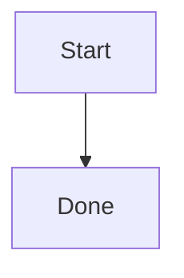

# SiYuan Markup Guide with the CLI

## Resolve the CLI entry first

Before the first SiYuan CLI call in every new session, verify that the local command is available:

```bash
command -v siyuan-sisyphus
siyuan-sisyphus --version
```

If the command is missing, resolve a locally installed or user-provided maintained CLI entry before continuing. Do not use `npx` as an implicit fallback. A public npm package may lag the locally maintained plugin and silently omit custom actions or safety contracts.

After resolving the entry, start with the read-only live bootstrap:

```bash
siyuan-sisyphus system bootstrap --json
```

Pass rich content as Markdown to block or document write actions. Keep each write bounded and read the result after insertion.

```bash
siyuan-sisyphus block append --parent-id '<doc-id>' --data-type 'markdown' --data '## Heading

Paragraph with **bold** text.' --json
```

## Common markup

```markdown
# Heading

**bold**, *italic*, ~~deleted~~, ==highlight==, `inline code`, #tag#

- Item
  - Nested item
- [ ] Task

| Name | Status |
| --- | --- |
| Draft | Done |

> **Note**
>
> Keep evidence with the decision.
```

Use an attribute view for real database behavior rather than a Markdown table.

## Math and diagrams

```markdown
Inline: $e^{i\pi}+1=0$

$$
\int_0^1 x^2 dx = \frac{1}{3}
$$
```

````markdown

````

## SiYuan-specific forms

- Block reference: `((<block-id> "Optional label"))`
- Embed query: `{{SELECT id, content FROM blocks WHERE content LIKE '%TODO%' LIMIT 20}}`
- Horizontal super block: wrap sibling blocks in `{{{row` and `}}}`.
- Vertical super block: wrap sibling blocks in `{{{col` and `}}}`.
- IAL attributes: `{: custom-key="value"}`; use dedicated attribute actions for programmatic metadata.

Do not invent unsupported Markdown extensions. For detailed layout rules or unfamiliar write fields, inspect `siyuan-sisyphus help block append` before writing.
